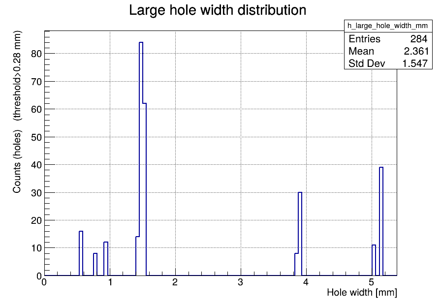

This .py script performs a "ray scan" in phi dimension with very small steps, and prints + draws the information about found gaps in acceptance.

The gaps are considered as "holes" if they are larger than the predefined allowed size (the gaps smaller than this size are considered "normal" -- e.g. the gaps between chips in modules).

Outputs: `.png` and `.root` with histograms per each material.

```
python sensitive_layer_overlap_check.py  o2sim_geometry.gdml --eta 0.01 \
    --phi-step 0.0001 --png out.png --csv out.csv --no-show \
    --root sensitive_scan.root  \
    --splitIntoRadialLayers  --maxAllowedHoleSize 0.28 \
    --materials TRK_SILICON FT3_SILICON
```



