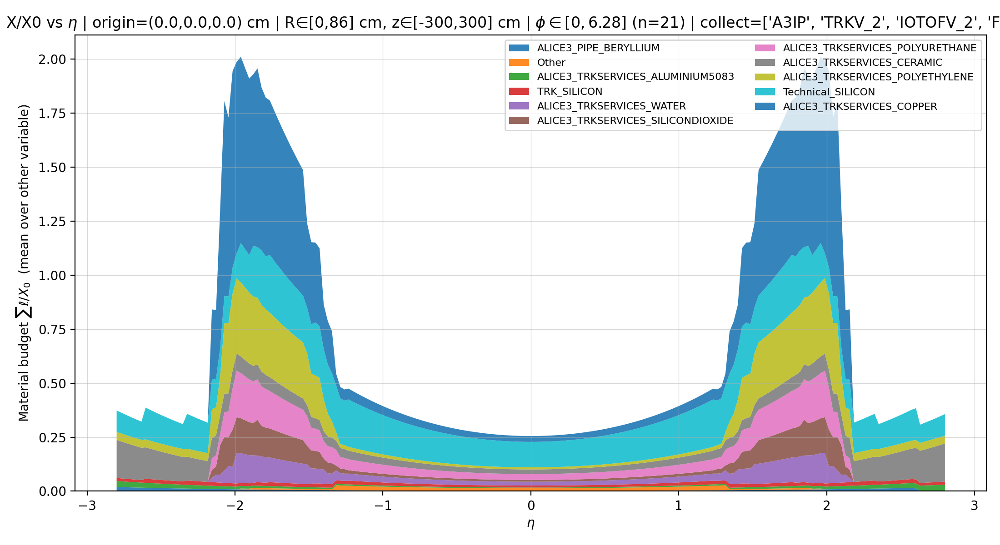

Flexible python script for detailed monitoring of the material budget (via scanning of `.gdml` file).
Outputs: `.png` and `.root` with histograms per each material.

```
python material_budget_gdml_scan.py \
  --gdml o2sim_geometry_example.gdml \
  --plot-vs eta \
  --phi-min 0 --phi-max 6.283185307 --n-phi 21 \
  --eta-min -2.8 --eta-max 2.8 --n-eta 201 \
  --rmin 0 --rmax 86 --zmin -300 --zmax 300  \
  --origin-x 0 --origin-y 0 --origin-z 0 \
  --top-materials 10 --max-steps 200000 \
  --collect-nodes A3IP \
  --collect-nodes TRKV_2 \
  --collect-nodes IOTOFV_2 \
  --collect-nodes FT3V_2 \
  --out mat_budget.png \
  --root-out mat_budget.root \
  --table-etas "0,1.5,2.4" --table-phis "0,0,0" --table-out-prefix myrays
```

If the optional `table-etas` and `table-phis` arguments are set, then, in addition, information about the material crossed by these defined "eta-phi rays" is stored in a .xlsx file.



